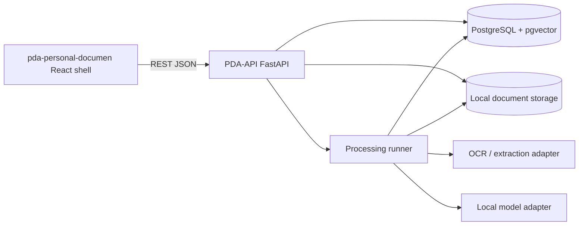

# PDA Foundation Architecture

The Foundation phase delivers a working local PDA shell: existing React frontend connected to a FastAPI backend, PostgreSQL with pgvector, local file storage, a replaceable processing runner, OCR/text extraction, chunking, embeddings, retrieval, chat with citations, report generation, persisted settings, and smoke tests.

